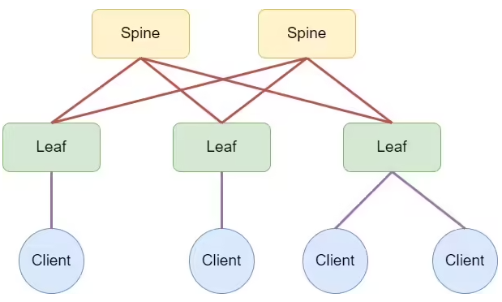

### Designing an address space

### Цели
- Part 1: Assemble the CLOS topology as shown in the diagram
- Part 2: Allocate address space for the Underlay network
- Part 3: Work plan, address space, network diagram, settings - are recorded in the documentation

### Реализовать схему

### Таблица ip адресов

|Source switch|Source Interface|Source IP|Destination switch|Destination interface|Destination IP|Loopback address|
|---|---|---|---|---|---|---|
SPINE-01|Eth1|10.111.3.0|LEAF-01|Eth1|10.111.3.1|
SPINE-01|Eth2|10.111.3.2|LEAF-02|Eth1|10.111.3.3|
SPINE-02|Eth1|10.111.3.4|LEAF-01|Eth2|10.111.3.5|
SPINE-02|Eth2|10.111.3.6|LEAF-02|Eth2|10.111.3.7|
SPINE-01|Eth3|10.111.3.10|LEAF-03|Eth2|10.111.3.11|
SPINE-02|Eth2|10.111.3.12|LEAF-03|Eth2|10.111.3.13|

### Введение

**Коммутатор (Leaf)** - Leaf уровень включает в себя коммутатор доступа, который подключается к конечным точкам, таким как серверы, устройства хранения.

**Коммутатор (Spine)** - Spine уровень состоит из коммутаторов, которые выполняют маршрутизацию, работая в качестве магистрали сети.

**Spine and Leaf Architecture (Close)** - Современный подход к строительству ДЦ, развитие идей из Bell Laboratories Чарльза Клоза. 

### Подготовка стенда

#### Схема стенда

#### Конфигурация SPINE-01
***
spine-01#sh run  
 Command: show running-config  
 device: spine-01 (vEOS-lab, EOS-4.29.2F)  

 boot system flash:/vEOS-lab.swi  

no aaa root  

transceiver qsfp default-mode 4x10G    

service routing protocols model ribd    

hostname spine-01    

spanning-tree mode mstp  

interface Ethernet1  
   description ## leaf-01 Eth1/1 ##  
   mtu 9214  
   no switchport  
   ip address 10.111.3.0/31  

interface Ethernet2  
   description ## leaf-02 Eth1 ##  
   mtu 9214  
   no switchport  
   ip address 10.111.3.2/31  

interface Ethernet3  
   description ## leaf-03 Eth1 ##  
   mtu 9214  
   no switchport  
   ip address 10.111.3.10/31  

interface Ethernet4  

interface Ethernet5  

interface Ethernet6  

interface Ethernet7  

interface Ethernet8  

interface Loopback0  
   ip address 10.111.1.1/32  

interface Management1  

ip routing  

end  
***

#### Конфигурация SPINE-02
***
spine-02#sh run  
Command: show running-config  
device: spine-02 (vEOS-lab, EOS-4.29.2F)  

boot system flash:/vEOS-lab.swi  

no aaa root  

transceiver qsfp default-mode 4x10G  

service routing protocols model ribd  

hostname spine-02  

spanning-tree mode mstp  

interface Ethernet1  
   description ## leaf-01 Eth2 ##  
   mtu 9214  
   no switchport  
   ip address 10.111.3.6/31  

interface Ethernet2  
   description ## leaf-02 Eth2 ##  
   mtu 9214  
   no switchport  
   ip address 10.111.3.4/31  

interface Ethernet3  
   description ## leaf-03 Eth2 ##  
   mtu 9214  
   no switchport  
   ip address 10.111.3.12/31  

interface Ethernet4  

interface Ethernet5  

interface Ethernet6  

interface Ethernet7  

interface Ethernet8  

interface Management1  

ip routing  

end
*** 

#### Конфигурация LEAF-01
***
leaf-01#sh run  
 Command: show running-config  
 device: leaf-01 (vEOS-lab, EOS-4.29.2F)  

 boot system flash:/vEOS-lab.swi  

no aaa root   

transceiver qsfp default-mode 4x10G    

service routing protocols model ribd    

hostname leaf-01    

spanning-tree mode mstp  

interface Ethernet1  
   description ## spine-01 Eth1 ##  
   mtu 9214  
   no switchport  
   ip address 10.111.3.1/31  

interface Ethernet2  
   description ## spine-02 Eth1 ##  
   mtu 9214  
   no switchport  
   ip address 10.111.3.7/31  

interface Ethernet3  

interface Ethernet4  

interface Ethernet5  

interface Ethernet6  

interface Ethernet7  

interface Ethernet8  

interface Loopback0  
   ip address 10.111.1.3/32  

interface Management1  

ip routing  

end  
***

#### Конфигурация LEAF-02
***
leaf-02#sh run  
 Command: show running-config  
 device: leaf-02 (vEOS-lab, EOS-4.29.2F)  

 boot system flash:/vEOS-lab.swi  

no aaa root  

transceiver qsfp default-mode 4x10G  

service routing protocols model ribd  

hostname leaf-02  

spanning-tree mode mstp  

interface Ethernet1  
   description ## spine-01 Eth2 ##  
   mtu 9214  
   no switchport  
   ip address 10.111.3.3/31  

interface Ethernet2  
   description ## spine-02 Eth2 ##  
   mtu 9214  
   no switchport  
   ip address 10.111.3.5/31  

interface Ethernet3  
 
interface Ethernet4

interface Ethernet5

interface Ethernet6

interface Ethernet7

interface Ethernet8

interface Loopback0  
   ip address 10.111.1.4/32  

interface Management1

ip routing

end
***

#### Конфигурация LEAF-03
***
leaf-03#sh run  
 Command: show running-config  
 device: leaf-03 (vEOS-lab, EOS-4.29.2F)  

 boot system flash:/vEOS-lab.swi  

no aaa root  

transceiver qsfp default-mode 4x10G  

service routing protocols model ribd  

hostname leaf-03  
 
spanning-tree mode mstp  

interface Ethernet1  
   description ## spine-01 Eth3 ##  
   mtu 9214  
   no switchport  
   ip address 10.111.3.11/31  

interface Ethernet2  
   description ## spine-02 Eth3 ##  
   mtu 9214  
   no switchport  
   ip address 10.111.3.13/31  

interface Ethernet3  

interface Ethernet4  

interface Ethernet5  

interface Ethernet6  

interface Ethernet7  

interface Ethernet8  

interface Loopback0  
   ip address 10.111.1.5/32  

interface Management1  

ip routing  

end  

***

### Проверка сетевой связанности:

Проверим, что с spine-01 можем достучаться leaf-01: 

spine-01#sh ip arp   
Address         Age (sec)  Hardware Addr   Interface  
spine-01#ping 10.111.3.1  
PING 10.111.3.1 (10.111.3.1) 72(100) bytes of data.  
80 bytes from 10.111.3.1: icmp_seq=1 ttl=64 time=20.7 ms  
80 bytes from 10.111.3.1: icmp_seq=2 ttl=64 time=9.33 ms  
80 bytes from 10.111.3.1: icmp_seq=3 ttl=64 time=4.60 ms  
80 bytes from 10.111.3.1: icmp_seq=4 ttl=64 time=4.44 ms  
80 bytes from 10.111.3.1: icmp_seq=5 ttl=64 time=4.53 ms  

--- 10.111.3.1 ping statistics ---  
5 packets transmitted, 5 received, 0% packet loss, time 68ms  
rtt min/avg/max/mdev = 4.443/8.742/20.792/6.306 ms, pipe 2, ipg/ewma 17.091/14.463 ms  

Проверим, что с spine-01 можем достучаться leaf-02:  

spine-01#ping 10.111.3.3  
PING 10.111.3.3 (10.111.3.3) 72(100) bytes of data.  
80 bytes from 10.111.3.3: icmp_seq=1 ttl=64 time=17.6 ms  
80 bytes from 10.111.3.3: icmp_seq=2 ttl=64 time=9.38 ms  
80 bytes from 10.111.3.3: icmp_seq=3 ttl=64 time=4.64 ms  
80 bytes from 10.111.3.3: icmp_seq=4 ttl=64 time=5.05 ms  
80 bytes from 10.111.3.3: icmp_seq=5 ttl=64 time=4.89 ms  

--- 10.111.3.3 ping statistics ---  
5 packets transmitted, 5 received, 0% packet loss, time 56ms  
rtt min/avg/max/mdev = 4.648/8.316/17.601/4.963 ms, pipe 2, ipg/ewma 14.009/12.713 ms  

Проверим, что с spine-01 можем достучаться leaf-03:  

spine-01#ping 10.111.3.11  
PING 10.111.3.11 (10.111.3.11) 72(100) bytes of data.  
80 bytes from 10.111.3.11: icmp_seq=1 ttl=64 time=17.6 ms  
80 bytes from 10.111.3.11: icmp_seq=2 ttl=64 time=9.42 ms  
80 bytes from 10.111.3.11: icmp_seq=3 ttl=64 time=4.84 ms  
80 bytes from 10.111.3.11: icmp_seq=4 ttl=64 time=4.63 ms  
80 bytes from 10.111.3.11: icmp_seq=5 ttl=64 time=5.28 ms  

--- 10.111.3.11 ping statistics ---  
5 packets transmitted, 5 received, 0% packet loss, time 56ms  
rtt min/avg/max/mdev = 4.632/8.360/17.624/4.955 ms, pipe 2, ipg/ewma 14.211/12.750 ms  

