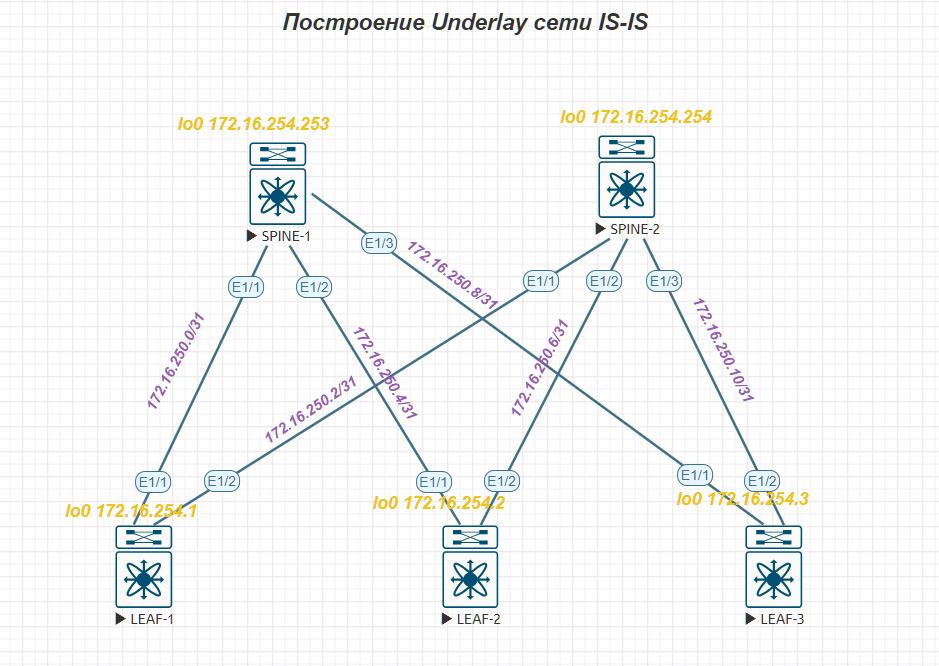

### Underlay. IS-IS

### Цель
Настроить IS-IS для Underlay сети

### Схема сети Underlay IS-IS

### Таблица ip адресов

|Source switch|Source Interface|Source IP|Destination switch|Destination interface|Destination IP|
|---|---|---|---|---|---|
SPINE-01|Eth1/1|172.16.250.1|LEAF-01|Eth1/1|172.16.250.0|
SPINE-01|Eth1/2|172.16.250.5|LEAF-02|Eth1/1|172.16.250.4|
SPINE-02|Eth1/1|172.16.250.3|LEAF-01|Eth1/2|172.16.250.2|
SPINE-02|Eth1/2|172.16.250.7|LEAF-02|Eth1/2|172.16.250.6|
SPINE-01|Eth1/3|172.16.250.9|LEAF-03|Eth1/1|172.16.250.8|
SPINE-02|Eth1/3|172.16.250.11|LEAF-03|Eth1/3|172.16.250.10|

### ip адреса loopback

|Source switch|Loopback Interface|
|---|---|
SPINE-01|172.16.254.253|
SPINE-02|172.16.254.254|
LEAF-01|172.16.254.1|
LEAF-02|172.16.254.2|
LEAF-03|172.16.250.3|

#### Конфигурация SPINE-01
***
version 9.3(8) Bios:version  
hostname spine-01  
vdc spine-01 id 1  
  limit-resource vlan minimum 16 maximum 4094  
  limit-resource vrf minimum 2 maximum 4096  
  limit-resource port-channel minimum 0 maximum 511  
  limit-resource u4route-mem minimum 248 maximum 248  
  limit-resource u6route-mem minimum 96 maximum 96  
  limit-resource m4route-mem minimum 58 maximum 58  
  limit-resource m6route-mem minimum 8 maximum 8  

feature isis  

no password strength-check  
username admin password 5 $5$CDHKCJ$Y9G620R1RdX8LlJOy.0rZzVu5scridRvOf3n/jlP/7D  
 role network-admin  
ip domain-lookup  
copp profile strict  
snmp-server user admin network-admin auth md5 331CC0104DE04353B00FDCEDF5019D8DB5  
0E priv 206AE13C3CCE2316AF4B82BDF6549F87B605 localizedV2key  
rmon event 1 log trap public description FATAL(1) owner PMON@FATAL  
rmon event 2 log trap public description CRITICAL(2) owner PMON@CRITICAL  
rmon event 3 log trap public description ERROR(3) owner PMON@ERROR  
rmon event 4 log trap public description WARNING(4) owner PMON@WARNING  
rmon event 5 log trap public description INFORMATION(5) owner PMON@INFO  

vlan 1  

vrf context management  

interface Ethernet1/1  
  description leaf-01 Eth1/1  
  ip address 172.16.250.1/31  
  ip router isis UNDERLAY  
  no shutdown  

interface Ethernet1/2  
  description leaf-02 Eth1/1  
  ip address 172.16.250.5/31  
  ip router isis UNDERLAY  
  no shutdown  

interface Ethernet1/3  
  description leaf-03 Eth1/1  
  ip address 172.16.250.9/31  
  ip router isis UNDERLAY  
  no shutdown  

interface mgmt0  
  vrf member management  

interface loopback0  
  description RID0  
  ip address 172.16.254.253/32  
  ip router isis UNDERLAY  
icam monitor scale  

cli alias name wr copy running-config startup-config  
line console  
line vty  
boot nxos bootflash:/nxos.9.3.8.bin sup-1  
router isis UNDERLAY  
  net 49.0001.1720.1625.4000.00  
  is-type level-2  
  set-overload-bit on-startup 60  
  log-adjacency-changes  
***

#### Конфигурация SPINE-02
***
version 9.3(8) Bios:version  
hostname spine-02  
vdc spine-02 id 1  
  limit-resource vlan minimum 16 maximum 4094  
  limit-resource vrf minimum 2 maximum 4096  
  limit-resource port-channel minimum 0 maximum 511  
  limit-resource u4route-mem minimum 248 maximum 248  
  limit-resource u6route-mem minimum 96 maximum 96  
  limit-resource m4route-mem minimum 58 maximum 58  
  limit-resource m6route-mem minimum 8 maximum 8  

feature isis  
 
no password strength-check  
username admin password 5 $5$NEFCNH$4OvsxZrT2DVD33xvvn.pFnMtVJTjxGnhVFpqUOruRn/  
 role network-admin  
ip domain-lookup  
copp profile strict  
snmp-server user admin network-admin auth md5 174DBDB97182F52D8E2F939470CAD4864C  
78 priv 3308E99207F39114E70A8BCC6CC8DBAE0933 localizedV2key  
rmon event 1 log trap public description FATAL(1) owner PMON@FATAL  
rmon event 2 log trap public description CRITICAL(2) owner PMON@CRITICAL  
rmon event 3 log trap public description ERROR(3) owner PMON@ERROR  
rmon event 4 log trap public description WARNING(4) owner PMON@WARNING  
rmon event 5 log trap public description INFORMATION(5) owner PMON@INFO  

vlan 1  

vrf context management  

interface Ethernet1/1  
  description leaf-01 Eth1/2  
  ip address 172.16.250.3/31  
  ip router isis UNDERLAY  
  no shutdown  

interface Ethernet1/2
  description leaf-02 Eth1/2
  ip address 172.16.250.7/31
  ip router isis UNDERLAY
  no shutdown

interface Ethernet1/3  
  description leaf-03 Eth1/2  
  ip address 172.16.250.11/31  
  ip router isis UNDERLAY  
  no shutdown  

interface mgmt0  
  vrf member management  

interface loopback0  
  description RID0  
  ip address 172.16.254.254/32  
  ip router isis UNDERLAY  
icam monitor scale  

cli alias name wr copy running-config startup-config  
line console  
line vty  
boot nxos bootflash:/nxos.9.3.8.bin sup-1  
router isis UNDERLAY  
  net 49.0001.1720.1625.4001.00  
  is-type level-2  
  set-overload-bit on-startup 60  
  log-adjacency-changes  
***

#### Конфигурация LEAF-01
***
hostname leaf-01  
vdc leaf-01 id 1  
  limit-resource vlan minimum 16 maximum 4094  
  limit-resource vrf minimum 2 maximum 4096  
  limit-resource port-channel minimum 0 maximum 511  
  limit-resource u4route-mem minimum 248 maximum 248  
  limit-resource u6route-mem minimum 96 maximum 96  
  limit-resource m4route-mem minimum 58 maximum 58  
  limit-resource m6route-mem minimum 8 maximum 8  

feature isis  

no password strength-check  
username admin password 5 $5$GGELBJ$zjEU940KQ7W6Vz6oWjolUXATM2zXwMw.ZPfPh/gF6OC  
 role network-admin  
ip domain-lookup  
copp profile strict  
snmp-server user admin network-admin auth md5 017741385A8E2FB842120E0FB2061FD872  
99 priv 49733F4763BB39EE2E1A5104E56917DB20A8 localizedV2key  
rmon event 1 log trap public description FATAL(1) owner PMON@FATAL  
rmon event 2 log trap public description CRITICAL(2) owner PMON@CRITICAL  
rmon event 3 log trap public description ERROR(3) owner PMON@ERROR  
rmon event 4 log trap public description WARNING(4) owner PMON@WARNING  
rmon event 5 log trap public description INFORMATION(5) owner PMON@INFO  

vlan 1  

vrf context management  

interface Ethernet1/1  
  description to spine-01 Eth1/1  
  ip address 172.16.250.0/31  
  ip router isis UNDERLAY  
  no shutdown  

interface Ethernet1/2  
  description to spine-02 Eth1/1  
  ip address 172.16.250.2/31  
  ip router isis UNDERLAY  
  no shutdown  

interface mgmt0  
  vrf member management  

interface loopback0  
  description RID0  
  ip address 172.16.254.1/32  
  ip router isis UNDERLAY  
icam monitor scale  

cli alias name wr copy running-config startup-config  
line console  
line vty  
boot nxos bootflash:/nxos.9.3.8.bin sup-1  
router isis UNDERLAY  
  net 49.0001.1720.1625.4002.00  
  is-type level-2  
  set-overload-bit on-startup 60  
  log-adjacency-changes  
  ***

#### Конфигурация LEAF-02
***
hostname leaf-02  
vdc leaf-02 id 1  
  limit-resource vlan minimum 16 maximum 4094  
  limit-resource vrf minimum 2 maximum 4096  
  limit-resource port-channel minimum 0 maximum 511  
  limit-resource u4route-mem minimum 248 maximum 248  
  limit-resource u6route-mem minimum 96 maximum 96  
  limit-resource m4route-mem minimum 58 maximum 58  
  limit-resource m6route-mem minimum 8 maximum 8  

feature isis  

no password strength-check  
username admin password 5 $5$ADANEJ$P4qJqKSLF9ISYukAynPh0UtZodImBN/Sag4FHasw7fC  
 role network-admin  
ip domain-lookup  
copp profile strict  
snmp-server user admin network-admin auth md5 483AED2FC1362101DCE5432C2B0CDC58FC  
34 priv 0060B0239F6E045E94E801223A11F618B617 localizedV2key  
rmon event 1 log trap public description FATAL(1) owner PMON@FATAL  
rmon event 2 log trap public description CRITICAL(2) owner PMON@CRITICAL  
rmon event 3 log trap public description ERROR(3) owner PMON@ERROR  
rmon event 4 log trap public description WARNING(4) owner PMON@WARNING  
rmon event 5 log trap public description INFORMATION(5) owner PMON@INFO  

vlan 1  

vrf context management  

interface Ethernet1/1  
  description spine-01 Eth1/2  
  ip address 172.16.250.4/31  
  ip router isis UNDERLAY  
  no shutdown  

interface Ethernet1/2  
  description spine-02 Eth1/2  
  ip address 172.16.250.6/31  
  ip router isis UNDERLAY  
  no shutdown  

interface mgmt0  
  vrf member management  

interface loopback0  
  description RID0  
  ip address 172.16.254.2/32  
  ip router isis UNDERLAY  
icam monitor scale  

cli alias name wr copy running-config startup-config  
line console  
line vty  
boot nxos bootflash:/nxos.9.3.8.bin sup-1  
router isis UNDERLAY  
  net 49.0001.1720.1625.4003.00  
  is-type level-2  
  set-overload-bit on-startup 60  
  log-adjacency-changes  
***

#### Конфигурация LEAF-03
***
hostname leaf-03  
vdc leaf-03 id 1  
  limit-resource vlan minimum 16 maximum 4094  
  limit-resource vrf minimum 2 maximum 4096  
  limit-resource port-channel minimum 0 maximum 511  
  limit-resource u4route-mem minimum 248 maximum 248  
  limit-resource u6route-mem minimum 96 maximum 96  
  limit-resource m4route-mem minimum 58 maximum 58  
  limit-resource m6route-mem minimum 8 maximum 8  

feature isis  
 
no password strength-check  
username admin password 5 $5$FFDAGD$ua0qR1ctA6xDIMVUslmA61.U09OkUd4dd4eveTQwod/  
 role network-admin  
ip domain-lookup  
copp profile strict  
snmp-server user admin network-admin auth md5 167E1A0A2A5076BAF02BD62DA8E29C6095  
B2 priv 014232253012729DE340E23DE6A7F16CD2E0 localizedV2key  
rmon event 1 log trap public description FATAL(1) owner PMON@FATAL  
rmon event 2 log trap public description CRITICAL(2) owner PMON@CRITICAL  
rmon event 3 log trap public description ERROR(3) owner PMON@ERROR  
rmon event 4 log trap public description WARNING(4) owner PMON@WARNING  
rmon event 5 log trap public description INFORMATION(5) owner PMON@INFO  

vlan 1  

vrf context management  

interface Ethernet1/1  
  description spine-01 Eth1/3  
  ip address 172.16.250.8/31  
  ip router isis UNDERLAY  
  no shutdown  

interface Ethernet1/2  
  description spine-02 Eth1/3  
  mtu 9216  
  ip address 172.16.250.10/31  
  ip router isis UNDERLAY  
  no shutdown  

interface mgmt0  
  vrf member management  

interface loopback0  
  description RID0  
  ip address 172.16.254.3/32  
  ip router isis UNDERLAY  
icam monitor scale  

cli alias name wr copy running-config startup-config  
line console  
line vty  
boot nxos bootflash:/nxos.9.3.8.bin sup-1  
router isis UNDERLAY  
  net 49.0001.1720.1625.4004.00  
  is-type level-2  
  set-overload-bit on-startup 60  
  log-adjacency-changes  
***

### Проверка сетевой связанности:

__Проверка состояния смежности протокола ISIS на spine-01:__   
spine-01# sh isis adjacency  
IS-IS process: UNDERLAY VRF: default  
IS-IS adjacency database:  
Legend: '!': No AF level connectivity in given topology  
System ID       SNPA            Level  State  Hold Time  Interface  
leaf-01         5005.0000.1b08  2      UP     00:00:08   Ethernet1/1  
leaf-02         5003.0000.1b08  2      UP     00:00:08   Ethernet1/2  
leaf-03         5002.0000.1b08  2      UP     00:00:07   Ethernet1/3  

Проверка базы состояния связей ISIS на spine-01:   
spine-01# sh isis database  
IS-IS Process: UNDERLAY LSP database VRF: default  
IS-IS Level-1 Link State Database  
  LSPID                 Seq Number   Checksum  Lifetime   A/P/O/T  

IS-IS Level-2 Link State Database
  LSPID                 Seq Number   Checksum  Lifetime   A/P/O/T  
  spine-01.00-00      * 0x0000014E   0xF9BB    745        0/0/0/3  
  spine-02.00-00        0x0000014F   0x8E16    746        0/0/0/3  
  spine-02.02-00        0x00000148   0x5D0B    816        0/0/0/3  
  spine-02.03-00        0x00000002   0xEEBE    747        0/0/0/3  
  leaf-01.00-00         0x0000014D   0xB754    1052       0/0/0/3  
  leaf-01.01-00         0x00000148   0x5515    1111       0/0/0/3  
  leaf-01.02-00         0x00000148   0x5711    1119       0/0/0/3  
  leaf-02.00-00         0x0000014D   0xE313    824        0/0/0/3  
  leaf-02.01-00         0x0000014A   0x5D09    898        0/0/0/3  
  leaf-03.00-00         0x0000014D   0x3DA2    807        0/0/0/3  
  leaf-03.01-00         0x00000002   0xFCB0    748        0/0/0/3  

Проверим, что с spine-01 можем достучаться до адреса loopback leaf-01:  
spine-01# ping 172.16.254.1  
PING 172.16.254.1 (172.16.254.1): 56 data bytes  
64 bytes from 172.16.254.1: icmp_seq=0 ttl=254 time=5.433 ms  
64 bytes from 172.16.254.1: icmp_seq=1 ttl=254 time=2.636 ms  
64 bytes from 172.16.254.1: icmp_seq=2 ttl=254 time=2.5 ms  
64 bytes from 172.16.254.1: icmp_seq=3 ttl=254 time=2.501 ms  
64 bytes from 172.16.254.1: icmp_seq=4 ttl=254 time=2.443 ms  

--- 172.16.254.1 ping statistics ---  
5 packets transmitted, 5 packets received, 0.00% packet loss  
round-trip min/avg/max = 2.443/3.102/5.433 ms  

Проверим, что с spine-01 можем достучаться до адреса loopback leaf-02:  
spine-01# ping 172.16.254.2  
PING 172.16.254.2 (172.16.254.2): 56 data bytes  
64 bytes from 172.16.254.2: icmp_seq=0 ttl=254 time=3.785 ms  
64 bytes from 172.16.254.2: icmp_seq=1 ttl=254 time=2.504 ms  
64 bytes from 172.16.254.2: icmp_seq=2 ttl=254 time=2.174 ms  
64 bytes from 172.16.254.2: icmp_seq=3 ttl=254 time=2.428 ms  
64 bytes from 172.16.254.2: icmp_seq=4 ttl=254 time=2.675 ms  

--- 172.16.254.2 ping statistics ---  
5 packets transmitted, 5 packets received, 0.00% packet loss  
round-trip min/avg/max = 2.174/2.713/3.785 ms  

Проверим, что с spine-01 можем достучаться до адреса loopback leaf-03:  
spine-01# ping 172.16.254.3
PING 172.16.254.3 (172.16.254.3): 56 data bytes  
64 bytes from 172.16.254.3: icmp_seq=0 ttl=254 time=4.527 ms  
64 bytes from 172.16.254.3: icmp_seq=1 ttl=254 time=3.268 ms  
64 bytes from 172.16.254.3: icmp_seq=2 ttl=254 time=6.267 ms  
64 bytes from 172.16.254.3: icmp_seq=3 ttl=254 time=4.039 ms  
64 bytes from 172.16.254.3: icmp_seq=4 ttl=254 time=3.616 ms  

--- 172.16.254.3 ping statistics ---
5 packets transmitted, 5 packets received, 0.00% packet loss
round-trip min/avg/max = 3.268/4.343/6.267 ms

--- 172.16.254.3 ping statistics ---  
5 packets transmitted, 5 packets received, 0.00% packet loss  
round-trip min/avg/max = 2.353/3.492/5.034 ms  

Проверим, что с spine-01 можем достучаться до адреса loopback spine-02:  
spine-01# ping 172.16.254.254  
PING 172.16.254.254 (172.16.254.254): 56 data bytes  
64 bytes from 172.16.254.254: icmp_seq=0 ttl=253 time=9.062 ms  
64 bytes from 172.16.254.254: icmp_seq=1 ttl=253 time=6.261 ms  
64 bytes from 172.16.254.254: icmp_seq=2 ttl=253 time=6.524 ms  
64 bytes from 172.16.254.254: icmp_seq=3 ttl=253 time=6.661 ms  
64 bytes from 172.16.254.254: icmp_seq=4 ttl=253 time=6.826 ms  

--- 172.16.254.254 ping statistics ---  
5 packets transmitted, 5 packets received, 0.00% packet loss  
round-trip min/avg/max = 6.261/7.066/9.062 ms  

